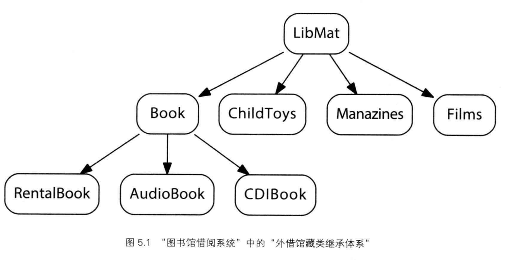

i  Essential C++

- [1 C++ 编程基础](#1-c-编程基础)
  - [1.1 如何撰写C++程序](#11-如何撰写c程序)
  - [1.2 对象的定义与初始化](#12-对象的定义与初始化)
  - [1.3 撰写表达式](#13-撰写表达式)
  - [1.4 条件语句和循环语句](#14-条件语句和循环语句)
  - [1.5 如何运用 Array 和 Vector](#15-如何运用-array-和-vector)
  - [1.6 指针带来的弹性](#16-指针带来的弹性)
  - [文件的读写](#文件的读写)
- [2 面向过程的编程风格](#2-面向过程的编程风格)
  - [2.1 如何编写函数](#21-如何编写函数)
  - [2.2 调用函数](#22-调用函数)
    - [Pass by Reference 语义](#pass-by-reference-语义)
    - [作用域及范围](#作用域及范围)
    - [动态内存管理](#动态内存管理)
  - [2.3 提供默认参数值](#23-提供默认参数值)
  - [2.4 使用局部静态对象](#24-使用局部静态对象)
  - [2.5 声明 inline 函数](#25-声明-inline-函数)
  - [2.6 提供重载函数](#26-提供重载函数)
  - [2.7 定义并使用木模板函数](#27-定义并使用木模板函数)
  - [2.8 函数指针带来更大的弹性](#28-函数指针带来更大的弹性)
  - [2.9 设定头文件](#29-设定头文件)
- [3 泛型编程风格](#3-泛型编程风格)
  - [3.1 指针的算数运算](#31-指针的算数运算)
  - [3.2 了解Iterator 泛型指针](#32-了解iterator-泛型指针)
  - [3.3 所有容器的共同操作](#33-所有容器的共同操作)
  - [3.4 顺序型容器](#34-顺序型容器)
  - [3.5 使用泛型算法](#35-使用泛型算法)
  - [3.6 如何设计一个泛型算法](#36-如何设计一个泛型算法)
    - [Function Object](#function-object)
    - [Function Object Adapter](#function-object-adapter)
  - [3.7 使用Map](#37-使用map)
  - [3.8 使用set](#38-使用set)
  - [3.9 如何使用 Iterator Inserter](#39-如何使用-iterator-inserter)
  - [3.10 使用 iostream Iterator](#310-使用-iostream-iterator)
- [4 基于对象的编程风格](#4-基于对象的编程风格)
  - [4.1 如何实现一个Class](#41-如何实现一个class)
  - [4.2 什么是构造函数和析构函数](#42-什么是构造函数和析构函数)
    - [Member Initialization List (成员初始化列表)](#member-initialization-list-成员初始化列表)
  - [4.3 何谓 mutable （可变）和 const （不变）](#43-何谓-mutable-可变和-const-不变)
    - [Mutable Data Member  (可变的数据成员)](#mutable-data-member--可变的数据成员)
  - [4.4 什么是 this 指针](#44-什么是-this-指针)
  - [4.5 静态类成员](#45-静态类成员)
    - [Static Member Function](#static-member-function)
  - [4.6 打造一个 Iterator Class](#46-打造一个-iterator-class)
    - [嵌套类型（Nested Type）](#嵌套类型nested-type)
  - [4.7 合作关系必须建立在友谊的基础上](#47-合作关系必须建立在友谊的基础上)
  - [4.8 实现一个copy assignment operator](#48-实现一个copy-assignment-operator)
  - [4.9 实现一个 function object](#49-实现一个-function-object)
  - [4.10 重载iostream 运算符](#410-重载iostream-运算符)
  - [4.11 指针，指向Class Member Function](#411-指针指向class-member-function)
- [5 面向对象变成风格](#5-面向对象变成风格)
  - [5.1 面向对象编程概念](#51-面向对象编程概念)
  - [5.2 漫游：面向对象编程思维](#52-漫游面向对象编程思维)
  - [5.3 不带继承的多态](#53-不带继承的多态)
  - [5.4 定义一个抽象基类](#54-定义一个抽象基类)
  - [5.5 定义一个派生类](#55-定义一个派生类)
  - [5.6 运用继承体系](#56-运用继承体系)
  - [5.7 基类应该多么抽象](#57-基类应该多么抽象)
  - [5.8 初始化，析构，复制](#58-初始化析构复制)
  - [5.9 在派生类中定义一个虚函数](#59-在派生类中定义一个虚函数)
  - [5.10 运行时的类型鉴定机制](#510-运行时的类型鉴定机制)
- [6 以template进行编程](#6-以template进行编程)
  - [6.1 被参数化的类型](#61-被参数化的类型)
  - [6.2 class template 的定义](#62-class-template-的定义)
  - [6.3 template 类型参数的处理](#63-template-类型参数的处理)
  - [6.4 实现一个 Class Template](#64-实现一个-class-template)
  - [6.5 一个以 Function Template 完成的Output 运算符](#65-一个以-function-template-完成的output-运算符)
  - [6.6 常量表达式与默认参数值](#66-常量表达式与默认参数值)
  - [6.7 以template 参数作为一种设计策略](#67-以template-参数作为一种设计策略)
  - [6.8 Member Template Function](#68-member-template-function)
- [7 异常处理](#7-异常处理)
  - [7.1 抛出异常](#71-抛出异常)
  - [7.2 捕获异常](#72-捕获异常)

## 1 C++ 编程基础

### 1.1 如何撰写C++程序

类(class)

- 用户自定义的数据类型，增强程序内之类型抽象化层次
- 类的定义包含两部分
  1. 头文件：申明该class提供的各种操作行为
  2. 程序代码文件：操作行为的实现内容

字符常量(character literal)

- 由单引号括住，分为两类
  1. 可打印字符，如 英文字母 'a', 'A' 等
  2. 不可打印字符，如 换行'\n', 制表符'\t'

命名空间(namespace)

- 是一种将库名称封装起来的方法，可以避免和应用程序发生命名冲突的问题 （不同实体具有相同的名称）

### 1.2 对象的定义与初始化

定义对象

- 命名，好的命名能够联想到该对象的属性
  1. 任何字母，数字，下划线的组合
  2. 区分大小写
  3. 不能以数字开头
  4. 不能与程序语言的关键字一致
- 数据类型，决定数值范围和内存空间

初始化方法

1. assignment 运算符（=）进行初始化
   - 沿袭自C语言
   - 内置类型或对象可以单一值加以初始化，没问题
   - `string sequence_name = "Fibonacci"`
2. 构造函数语法（constructor syntax）
   - 对象需要多个初值
     - 复数（complex number）类，需要两个初值，实部和虚部
   - 让语法统一，简化template的设计

```C++
# include <complex>
complex<double> purei(0, 7);
```

转义字符(escape sequence)

- '\n' newline
- '\t' tab
- '\0' null
- '\'' single quote
- '\"' double quote
- '\\' backslash

### 1.3 撰写表达式

- 两个整数相除会产生另一个整数，小数点后舍弃。

条件表达式

```text
expr
  ? 如果 expr 为 true, 执行这里
  : 如果 expr 为 fasle, 执行这里

```

- 0会被视为fasle，非零则视为true
  
复合赋值运算符

递增和递减运算符

- 前缀后缀

关系运算符

逻辑运算符

- 短路求值法

### 1.4 条件语句和循环语句

条件语句

- if else
- switch
  - break 控制是否向下穿越

循环语句

- while
  - break 控制结束循环
  - continue 终止当前循环
  
### 1.5 如何运用 Array 和 Vector

array

- 需要指定元素类型， 名称，大小
- 大小必须是常量表达式（constant expression），不需要在运行时求值的函数
- array 初始化
  - 初始化列表内的元素个数不超过array大小，前者数量小于array的大小，其余元素会被初始化为0.
  - 可根据初值的数量，自行计算array的大小

  ```C++
  int elem_seq[] = {
    1, 2, 3, 3, 4, 7, 2, 5, 12,
    3, 6, 10, 4, 9, 16, 5, 12, 22
  }
  ```

vector

- 需要包含vector头文件
- 类模板（class template）需要类名后尖括号内指定元素类型， 大小写在小括号内
- 大小不需要是常量表达式
- vector 初始化
  - 可利用array 初始化
  
  ```C++
  int elem_vals[seq_size] = {
    1, 2, 3, 3, 4, 7, 2, 5, 12,
    3, 6, 10, 4, 9, 16, 5, 12, 22
  }
  vector<int> elem_seq(elem_vals, elem_vals+seq_size0);
  ```

  - vector知道自己的大小，`elem_seq.size()`

索引从0开始叫做 off-by-one

for 循环

```C++
for (init-statement; condtion; expression )
  statement
```

- init-statement
  - 循环开始前被执行一次
  - 可留空
- condition
  - 用于循环控制，会子阿每次循环迭代前被计算
  - 可留空
- expression
  - 会在循环每次迭代结束后被求值
  - 可留空

### 1.6 指针带来的弹性

使用指针，舍弃以名称指定方式，间接访问每个vector, 从而达到透明化

& 取地址

\* 提领

- 既可以操作指针包含的内存地址，也可以操作所指的对象
- 指针若不指向任何对象，则提领会导致未知结果。**使用指针时，必须在提领前确定他所指的对象**
  - 位置向任何对象的指针，其地址为0（null） 指针
  - 防止对null指针提领，可以检验地址是否为0

```C++
  tpye_of_object_pointed_to * name_of_pointer_object
```

dot

- 成员选择运算符
- 通过指针来选择，须改用arrow成员选择运算符

### 文件的读写

保存执行历史数据

- 对文件进行读写，需要包含fstream头文件
- 输出文件, ofstream对象
  - 希望保留原始内容，可以以追加模式打开文件
  - 文件可能打开失败，写入操作前，学确定文件是否打开成功
  - 打开失败，ofstream对象为fasle
- 读取文件, ifstream
  - 打开失败，对象俄文false
  - 写入位置，在起始处
- 同时读写，定义fstream对象
  - seekg(0), 重新定位之起始处

cerr

- 标准错误设备
- 与cout一样，将结果定向到用户终端。唯一差别cerr输出无缓冲，会立即显示到终端

endl

- 操纵符
- 插入一个换行符

## 2 面向过程的编程风格

目的：

- 整个程序写到main(),仅适合规模不大的程序，所有了面向过程编程

函数独立的好处

- 函数更易懂
- 方便复用
- 更模块化，方便协作

### 2.1 如何编写函数

函数定义（四部分）

- 返回类型
- 函数名
- 参数列表（parameter list)
- 函数体

函数需要先被声明，然后才能调用
  
函数声明

- 方便编译器检查后续使用是否正确(参数够？类型对? 等等)
- 函数声明不必提供函数体，需要 返回类型，函数名，参数列表

```C++
  int fibon_elem( int pos);
```

函数的定义

- 函数原型及函数体

多行注释 /**/

WARN: **永远不要相信用户的输入是符合规范的**

exit()

- 头文件，cstdlib
- 可用于函数推出，-1非正常,0正常
- 但过于激烈，可以使用抛出异常-》第7章

某类型最大/小值->numeric_limits class

```C++
#include <limits>
int max_int = numeric_limits<int>::max();
double max_double = numeric_limits<double>::min();

```

INFO: **函数声明的时候，建议写上参数名称**

### 2.2 调用函数

传址（by reference）
传值（by value)

程序堆栈（program stack）

- 调用函数时，会在内存中建立起一块特殊区域，称为程序堆栈
- 函数中定义的对象是local obejct， 一旦函数完成内存会被释放

#### Pass by Reference 语义

引用 -> 别名

- 无法改变reference所代表的对象

将参数声明为reference的理由

1. 希望对所传对象直接修改
2. 降低复制大型对象的额外负担

- pointer 与 reference 差异: pointer 可能（也可能不）指向某个实际对象，提领pointer, 一定要先确定其值并非0; reference, 则并定会代表某个对象，所以不需要此检查

- 内置类型，除非希望在函数中更改参数值，否则在传递内置类型时，不要使用传址方式。传址机制主要用于传递class object

#### 作用域及范围

除了 static(见 2.4节)， 函数内定义的对象，只存在与函数执行期间

WARN： **如果将所谓的局部对象（local object）的地址返回，会导致运行时错误**

scope: 对象在程序内的村或区域称为该对象的scope

- local scope
- file scope, 对象从声明点到文件末尾的哦苏和i可见的
- 内置类型对象，如果定义在file scope之内，必定被初始化为0；若在 local scope，除非程序员指定，否则不会被初始化。
- 都是系统自动管理
  
#### 动态内存管理

第三种储存形式：dynamic extent(动态范围)

- 内存有空闲空间（free store）分配，有时也称为 heap memory(堆内存)
- 程序员自己管理，new, delete
  - 由heap分配一个int对象，地址赋给pi

  ```C++
  int *pi;
  pi = new int;
  ```

  - 带初值

  ```C++
  pi = new int(1024);
  ```

  - 分配数组, C++没有提供任何语法让我们heap分配数组同时为其元素设定出值

  ```C++
  int *pia = new int[24];
  ```

  - 可以持续存活，直到delete 加以释放

  ```C++
  delete [] pia;
  ```

内存泄露（memory leak），若没有使用delete 表达式，由heap分配而来的对象就永远不会释放

第六章：什么时机使用动态内存分配
第七章：讨论异常处理时，预防memory leak的发生

### 2.3 提供默认参数值

函数过度依赖file scope内的对象，则很难重用，也难修改

默认参数规则

1. 默认值的解析操作由最右边开始进行。如果我们为某个参数提供了默认值，那么这一参数右侧的所有参数都必须也具有默认值才行。
2. 默认值只能指定一次，可以在函数声明出，也可以在函数定义处，但不能两个地方都有。
   - 为了更高的可见性，我们据诶的嗯将默认值放在函数声明出而非定义出

### 2.4 使用局部静态对象

局部静态对象 vs 局部非静态对象：

局部静态对象所处的内存空间， 即使在不同的函数调用过程中，依然存在。 所以 局部静态对象的 地址能够安全的返回

### 2.5 声明 inline 函数

inline 作用

- 要求编译器在每个函数调用点上，将函数内容展开。
- 编译器会将调用操作改为一份函数代码副本替代，改善性能

体积小，常调用的函数适合声明为inline函数。
  
### 2.6 提供重载函数

参数列表（parameter list）不相同（可能是参数类型不同，可能是参数个数不同）的两个或多个函数，可以拥有相同的函数名称

返回类型无法区分两个具有相同名称的函数

### 2.7 定义并使用木模板函数

类型信息由用户提供

elemType 只是个人一名称，可以选用（foobar,T等）

function template 同时也可以是重载函数

### 2.8 函数指针带来更大的弹性

函数指针（pinter to function）

- 定义的时候必须指明所指函数的返回类型及参数列表
- 调用法那个是和一般函数相同
- 指针记得确定是否指向对象
- 函数地址就是函数的名称
- 函数指针数组

```C++
const vector<int>* (*seq_array[])(int) = {
  fibon_seq, lucas_seq, pell_seq,
  triang_seq, square_seq, pent_seq
};
```

枚举类型（enumerated type）

- 可以作为辅助记忆的常量

  ```C++
  enum ns_type {
    ns_fibon, ns_lucas, ns_pell,
    ns_triang, ns_square, ns_pent
  };
  ```

  - ns_type 标识符 可有可无
  - 默认，第一个枚举项的值为0，后面递增1

### 2.9 设定头文件

- 避免多次声明，可以将函数声明放在头文件中，并子阿每个程序文件中包含（include）这些函数声明
- 函数的定义只能有一份，不过可以有多声明
- 只能定义一份的例外： inline 函数的定义。也应放在头文件中。
- file scope 内定义的对象，如果可能被多个文件访问，应该被声明在头文件中。
  - 对象要加 extern
  
    ```C++
    const int seq_cnt = 6;
    extern const vector<int>* (*seq_array[seq_cnt])(int);
    ```

  - const object 和 inline 函数一样

双引号 vs <>

- 位于统一磁盘目录下，使用双引号
- 不再磁盘目录，使用尖括号

## 3 泛型编程风格

function template 风格

STL 主要组成

1. 容器（container）,包括 vector, list, set, map
2. 泛型算法（generic algorithm）, 包括 find(), sort(), replace(), merge()

### 3.1 指针的算数运算

vector 和 array 的兼容

- 解法一： 头指针 + size

```C++
// version 1
template <typename elemType>
elemType* find(const elemType *array, int size, const elemType &value)
{
    if (! array || size < 1) {
        return 0;
    }

    for (int ix = 0; ix < size; ++ix) {
        if (array[ix] == value) {
            return &array[ix];
        }
    }
    return 0;
}

```

- 解法二： 头指针 + 尾指针， array 从参数列表中彻底消失

```C++
template <typename elemType>
elemType* find(const elemType *first, const elemType*last, const elemType &value) {
    if (! first || ! last) {
        return 0;
    }

    for (; first != last; ++first) {
        return first;
    }
    return 0;
}                           

```

为了安全和方便，针对vector 还需要有 begien 和 end 封装， 防止指针为空

```C++
template <typename elemType>
inline elemType* begin(const vector<elemType> &vec)
{  return vec.empty() ? 0 : &vec[0]}

template <typename elemType>
inline elemType* end(const vector<elemType> &vec)
{  return vec.empty() ? 0 : &vec[vec.size()]}
```

还要支持 list

- list 双向指针，相互链接, 并非连续存储
- 上述指针算数运算必须首先假设所有元素都储存在连续空间。
- 我们需要把底层指针的处理统统放到抽象层，让用户无需直接面对指针操作。

### 3.2 了解Iterator 泛型指针

上述抽象层如何实现？

iterator class， 让我们得以使用 “和指针相同的语法”来进行程序的编写;

第4章，iterator 的实现

iterator 定义需要：

1. 迭代对象的类型，决定如何访问下一个元素；
2. iterator所指的元素类型，决定iterator提领操作的返回值

- 定义

```C++
vector<string> svec;

vector<string>::iterator iter = svec.begin();
```

```C++
const vector<string> cs_vec;

vector<string>::const_iterator iter = cs_vec.begin();
```

- 取值，采用一般指针的提领方式 `*iter`， 调用底部的string元素提供的操作，可以使用 arrow (箭头)运算符 `iter->size()`

还能改进：

- 当前实现以来底部元素所属类型 相等 运算符。如果用户希望赋予 equality 运算符不同的意义，就需要其他解法：
  - 传入函数指针，取代云本固定使用的 equality运算符
  - 使用 function object
- 下个目标： 将find()演化为泛型算法（标准库提供的find_if(), 能够接受函数指针或function object, 取代底部元素的equality运算符，大大提供弹性）

### 3.3 所有容器的共同操作

所有容器（以及string类）的共同操作：

- equality(==)和inequality(!=)运算符，返回true或false
- assignment(=)运算符，将某个容器复制给另一个容器
- empty()会在容器无任何元素时返回true, 否则返回false
- size() 返回容器内目前持有的元素个数
- clear()删除所有元素
- 提供 begin()和end()函数，返回iterator
- insert()以及erase()用于删除元素
  - 视容器本身尾顺序(sequential)或关联(associative)型容器而有所不同

### 3.4 顺序型容器

相关头文件

```C++
#include <vector>
#include <list>
#include <deque>
```

vector

- 连续内存存放元素
- 随机访问，很有效率
- 插入，删除，缺乏效率
- 适合数列

list

- 双向链表，非连续内存
- 插入，删除，很有效率
- 随机访问，缺乏效率
- 适合档案中读取分数，并排序
- list 不支持iterator的偏移操作

deque

- 连续内存
- 前端尾端，插入删除，很有效率
  
定义顺序性容器对象方式

1. 产生空容器
2. 产生特定大小的容器
3. 产生特定大小的容器，并为每个元素制定初值
4. 通过iterator产生容器
5. 根据某个容器产生出新容器

push_front, pop_front, pop_back, pop_front, insert, erase

### 3.5 使用泛型算法

对应头文件, `#include <algorithm>`

find

- linear search

binary_search

- 对象一定要是排列后的

count

search

- 寻找子序列

max_element

copy

- 无法保证容器有足够容量时，用 inserter

附录B: 每个泛型算法的运行范例

### 3.6 如何设计一个泛型算法

#### Function Object

是 某种class的实例对象，这类class对function call 运算符进行了重载操作， 可当一般函数使用

function object 实现，主要为了效率，我们可以令call运算符成为inline，从而消除 “函数指针来调用函数”时需要付出的额外代价

算数运算
关系运算
逻辑运算

头文件，`#include <functional>`

#### Function Object Adapter

参数绑定

binder adapter（绑定适配器）会将function object 的参数绑定到某特定值， 可将binary (二元) function object 转化为 unary(一元)function object.

消除固定值比较，引入比较值参数
消除固定比较方法，引入比较函数指针
引入find_if，需要用 less function object 用 **bind2nd** function object adapter 转成1元
消除元素类型，引入function template

**negator**, 对 function object 的真伪取反。not1, not2

### 3.7 使用Map

- 头文件，`#include <map>`
- words[tword], 若tword不在 words中，它会因此放到map中，并获得默认值0。
- first, second
- 查询key 是否在 map中
  1. 直接索引，会改变map
  2. map的find()
  3. map的count()

### 3.8 使用set

默认，set 元素皆一句其所属类型默认的less-than运算符进行排序

set相关泛型算法： set_intersection(), set_union(), set_difference(), set_symmetric_difference()

### 3.9 如何使用 Iterator Inserter

3.6的做法，给一个符合条件的元素一一赋值至目的端，需要目的端容器必须够大。

STL提供 三个 insertion adapter， 可以避免使用容器的assignment运算符

- back_inserter()， 能以 push_back() 取代赋值
- inserter(), insert()取代赋值
- front_inserter(), push_front

头文件， `#include <iterator>`

不支持 array

### 3.10 使用 iostream Iterator

头文件， `#include <iterator>`

istream_iterator, ostream_iterator

## 4 基于对象的编程风格

对象即 class

class 两部分组成

- 公开（public）
- 私有（private）

class 的设计与实现，正式C++程序员的主要工作

### 4.1 如何实现一个Class

class template -> 第6章

inline 函数，定义于class主体内或主体外，并没有什么分别。 但也应该放在头文件中。

non-inline member function 应该在代码文件中定义，该文件通常和class同名。

### 4.2 什么是构造函数和析构函数

Constructor

- 函数名称必须与class 名称相同。
- 不应指定返回类型，也不用返回任何值
- 可以被重载

```C++
Triangular t3 = 8;
```

会调用有单一参数的constructor。

- 最简单的constructor 就是所谓的 default constructor。不需要任何参数
  - 他不接受任何参数
  - 他为每个参数提供默认值

#### Member Initialization List (成员初始化列表)

```C++
Triangular tri1(8);
Triangular tri2 = tri1; // 这里会存在析构问题
```

上面是默认的成员注意初始化操作 default memberwise initialization， 会有西沟的问题

所以需要设计 copy constructor

WARN:**设计class时， 必须问问装机，在此 class 之上进行“成员逐一初始化”的行为是否适当？如果不是，就需要定义copy constructor**

如果有 copy constructor 就同时需要 copy assignment operator (4.8节)， 5章

### 4.3 何谓 mutable （可变）和 const （不变）

- const 修饰符金结余函数参数列表后。凡是在class主体意外定义者， 如果他是一个 const member function, 那就必须同时在声明与定义中指定 const。
- const 版本，与 non-const 版本，重载解决

#### Mutable Data Member  (可变的数据成员)

- 将 _next 标示谓 mutable， 我们就可以宣称： 对_next 所做的改变并不会破坏 class object的常量性

### 4.4 什么是 this 指针

- this 指针系在member function 内用来指向其调用者（一个对象）

### 4.5 静态类成员

- class 需要唯一的容器来储存数列元素时， static可以解决
- static data member表示唯一的，可共享的member
- const static  可以声明时为其确定初值

#### Static Member Function 

static member function 不访问任何 non-static member

在class 外部进行member function 定义时，无需重复加上关键字 static， 也适合 static data member

### 4.6 打造一个 Iterator Class

- 性质相反的运算符，通常会以后者实现前者

运算符重载规则

- 不可以引入新的运算符
- 运算符操作数个数不可改变
- 运算符优先级不可改变
- 运算符的参数列表中，必须至少有一个参数为class类型。

对于 ++ 后置版本，编译器会自动为后置版产生一个int参数（其值必为0）

#### 嵌套类型（Nested Type）

typedef, 可以为某个类型设定另一个不同的名称
`typedef existing_type new_name`

### 4.7 合作关系必须建立在友谊的基础上

friend

- 具备了与class member function 相同的访问权限
- 函数的原型(prototype)前加上关键字friend，就可以将它声明为某个class的friend
- 声明可以放在任何位置，不受private和public 的影响
- 也可以用 public member function 包装一下 private member
  - 提供一个public 访问权限的inline函数，是为了效率考虑

### 4.8 实现一个copy assignment operator

class data member 会被依次复制过去。_length,_beg_pos,_next都会从tri2被复制到tri1去。这称为default memberwise copy（默认的成员逐一复制操作）

4.2 Matrix 不适合 default memberwise,  需要 copy constructor 和一个 copy assignment operator。

若提供 copy assignment operator, 会取代 default memberwise copy行为

### 4.9 实现一个 function object

function object 需要实现 `operator()` function call 运算符

### 4.10 重载iostream 运算符

output 运算符不设计为member function

- 因为member function, 左操作数必须时隶属于同一个class的对象。

### 4.11 指针，指向Class Member Function

pointer to member function

- 与 pointer to non-memeber function 类似，但需要额外制定究竟是哪一个class
  
```C++
void (num_sequence::*pm)(int) = 0;
```

- typedef

  ```C++
  typedef void(num_sequence::*PtrType)(int);
  PtrType pm = 0;
  ```

- 取地址，`PtrType pm = &num_sequence::triangular;`
- s

WARN: maximal munch

- `a+++p`等同于`a++ + p`
- `vector<vector<int>>` 应写为 `vector<vector<int> >`

- 调用

```C++
num_sequence ns;
num_sequence *pns = &ns;
PtrType pm = &num_sequence::fibonacci;


(ns.*pm)(pos) # ns.fibonacci(pos)
(pns->*pm)(pos)  #pns->fibonacci(pos)
```

## 5 面向对象变成风格

类间的关系于"面向对象编程模型"

### 5.1 面向对象编程概念

面向对象编程主要特质：

- 继承(inheritance)
  - 定义（parent/child）关系
  - 父类定义所有子类共同的公有接口(public interface)和私有实现（private implementation）
  - 子类可以增加或覆盖（override）
  - 父类称为基类（base class）,子类被称为派生类（derived class）
- 多态(polymorphism)
  - pointer或reference的指向，执行时才知道
- 动态绑定（dynamic binding）
  - member function的调用，运行时才知道



### 5.2 漫游：面向对象编程思维

LibMat -> Book -> AudioBook

- 继承
  - 名称后面必须接一个冒号（：），然后紧跟着关键字public和基类的名字

protected

- 声明为 protected 的 所有成员都可以被派生类直接访问， 其他不能访问

### 5.3 不带继承的多态

对比一下 不带继承的多态 有多复杂

static_cast 是个特殊转记号，能静证书num 转换为对应的ns_type 枚举项

经过coding，我们发现不带继承的多态真的很繁琐

### 5.4 定义一个抽象基类

重新实现 num_sequence class

设计出抽象基类，然后继承他

- 找出数列类的共同操作
- 找出虚函数，不同派生类有不同的实现方式
  - static member function 无法被声明为虚函数
  - 虚函数对此类无意义，可以设置为纯虚函数，即赋值 0
- 访问层级
  - public, private, protected


有纯虚函数的类，接口不完整，无法产生对象。只能作为派生类的子对象使用。

凡基类定义有一个或多个虚函数，应将其destuctor声明为virtual

### 5.5 定义一个派生类

派生类

- 名称之后紧跟冒号，关键字public，以及基类的名称。
- 类进行继承声明之前，其基类的定义必存在

- non-virtual 函数，无法被基类提供的实体覆盖。无法被基类的 pointer 或 reference 访问
- 同名member会覆盖基类的member，调用父类的需要class scope

### 5.6 运用继承体系

无

### 5.7 基类应该多么抽象

另外一种设计方式：将所有派生类共有的实现内容剥离出来，移至基类。=>简化提供派生类而必须付出的代价

### 5.8 初始化，析构，复制

- 派生类初始化行为，包含调用其基类的constructor,然后再调用派生类自己的constructor
- 派生类的constructor，不仅必须为派生类的data member 进行初始化操作，还需要为其基类的data member 提供适当的值
- 基类未定义copy constructor， 会调用default memberwise initialization

### 5.9 在派生类中定义一个虚函数

选择覆盖

- 函数原型必须完全符合基类所声明的函数原型
  - 参数列表
  - 返回类型
    - 例外，当基类的虚函数返回某个基类形式（pointer或reference）
  - 常量性，没有语法错误
- 在派生类中，virtual并非必要

函数静态解析（static resolution）

虚函数非预期行为：

- 基类的consturctor 和destructor
  - 基类的constructor中，派生类的虚函数绝对不会被调用
- 使用基类的对象，非几类对象的pointer或 reference
  - 多态需要一层间接性，唯有用基类的pointer和reference才能够支持面向对象编程概念

### 5.10 运行时的类型鉴定机制

typeid 运算符

- 得以查询堕胎的class pointer 或 class reference, 获得其所指对象的实际类型

static_cast 无条件转换
dynamic_cast 有条件转换

## 6 以template进行编程

前序遍历，根左右
中序遍历，左根右
后序遍历，左右根

### 6.1 被参数化的类型

无

### 6.2 class template 的定义

无

### 6.3 template 类型参数的处理

参数的传递，如果对象时类，传址方式传递可以减少不必要的开销

当处理 template 类型参数时，无法得知要用的类型是否为语言内置类型，所以建议：所有的template类型参数都视为 class 类型处理。

注意constructor函数体内赋值操作分为两步

1. 函数体执行前，是使用 default constructor （以 copy constructor 将 val 复制给 _val）
2. 函数体内以 copy assignment opreator

记得选择 member initialization list 为每个烈性参数进行初始化操作，只需要第一步就能完成工作。可以提升性能

### 6.4 实现一个 Class Template

new

1. free store 请求内存， 分配到，返回指针，指向新对象。（空间不足，抛出bad_alloc异常）
2. 如果第一步成功，并有指定的初值，新对象会以最适当的方式被初始化。

### 6.5 一个以 Function Template 完成的Output 运算符

无

### 6.6 常量表达式与默认参数值

常量表达式也可以作为 template 参数。

### 6.7 以template 参数作为一种设计策略

class template 无法基于参数列表的不同而重载

class template 的类型参数不仅能传递元素类型，还能传自定义类？

### 6.8 Member Template Function

看见没，template 还能在类的中间用

class template 也可以定义为member template function.

## 7 异常处理

4.6 Triangualr_iterator class，iterator 有潜在的错误，可能引发错误状态的产生。数据元素 _index 索引超出 static vector 范围。

能辨识 非有效状态，程序不能继续运行。但危害程度只有用户才知道。

职责：通知用户，告诉它发生了什么事

### 7.1 抛出异常

异常处理机制

1. 异常的鉴定
2. 异常的发出

异常处理完毕后，程序会从异常处理点继续执行下去

异常（exception）是某种对象。

- 最简单的就是整数或字符串
- 大部分是特定的异常类（也许形成一个继承体系）

### 7.2 捕获异常

catch 捕获 异常对象


